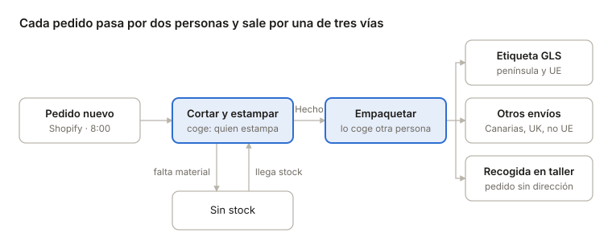

# Manual de uso · Programa de fábrica Singular Wardrobe

Este programa organiza todos los pedidos de la tienda online desde que entran hasta que salen del taller. Se abre en el navegador en [tallersingular.netlify.app](https://tallersingular.netlify.app) y lo usamos todas a la vez, desde un ordenador compartido o una tablet.

## 1. Antes de empezar

Cada mañana a las 8:00 el programa trae solo los pedidos nuevos de la tienda. No hace falta hacer nada para que aparezcan.

**Entrar**

1. Abre Chrome y entra en tallersingular.netlify.app.
2. Escribe el email y la contraseña de la fábrica y pulsa Entrar.
3. Si el ordenador se queda encendido, la sesión sigue abierta al día siguiente.

**Botones de la parte de arriba**

| Botón | Para qué sirve |
| --- | --- |
| Pedidos | La pantalla de trabajo: todos los pedidos ordenados por pestañas. |
| Resumen producción | Lo que hay que cortar y estampar, agrupado por modelo y talla. |
| Histórico | Los pedidos ya estampados o enviados, con quién lo hizo. |
| Ayuda | Este manual, con buscador por palabras y botón para imprimirlo en PDF. |
| ↻ Importar | Trae ahora los pedidos nuevos de la tienda, sin esperar a mañana. |
| Salir | Cierra la sesión. Úsalo solo si el ordenador lo usa otra gente. |

**Avisos de colores en la franja superior**

- **Franja roja «ERROR: no actualizado hoy»**: la actualización de las 8:00 ha fallado. Pulsa ↻ Importar. Si vuelve a salir, avisa a Tito.
- **Franja amarilla «MODO PRUEBAS»**: las etiquetas de GLS todavía son de prueba y no sirven para enviar. Desaparecerá cuando el programa funcione de verdad.

Todas las pantallas, los listados impresos, los PDF y los Excel llevan el logo de Singular Wardrobe.

La pantalla se actualiza sola: lo que hace una compañera aparece en tu pantalla en unos segundos. Si dudas, recarga la página con Cmd + Shift + R en Mac o Ctrl + F5 en Windows.

## 2. El recorrido de un pedido

Una persona corta y estampa, otra empaqueta, y el programa decide por qué vía sale según el destino. Si falta material, el pedido espera en Sin stock y vuelve a Cortar y estampar cuando llega.

## 3. Las pestañas de Pedidos

Cada pestaña muestra un grupo de pedidos y, al lado, cuántos hay. La etiqueta roja «N urg» indica cuántos son urgentes. Dentro de cada pestaña, los urgentes salen primero y después los más antiguos.

| Pestaña | Qué hay |
| --- | --- |
| ⚠ Retrasados | Pedidos que no han salido después de más de 7 días (urgentes: más de 3 días). Son la prioridad. |
| Pendientes | Solo aparece si alguien ha apartado un pedido a mano. |
| Sin stock | Pedidos con alguna prenda que no podemos hacer por falta de material o de stock. |
| Cortar y estampar | Pedidos que entran del día: hay que cortar el vinilo y estamparlo. |
| Empaquetar | Pedidos con todas las prendas hechas, listos para empaquetar y dar salida. |
| Producidos hoy | Lo que ha salido hoy. |
| Otros envíos | Pedidos que salieron sin etiqueta GLS (Canarias, fuera de la UE…), con la anotación de cómo salieron. |
| Recogida en tienda | Todos los pedidos que el cliente viene a buscar al taller. |
| Listos para recoger | Recogidas terminadas que el cliente aún no ha venido a buscar. |
| Recogidos | Recogidas ya entregadas al cliente, las últimas primero. |
| Sin etiqueta | Pedidos que han salido pero cuya etiqueta GLS no se llegó a imprimir. Hay que revisarlos. |
| Todos | Todos los pedidos del programa. |

El buscador de la derecha encuentra un pedido por su número (por ejemplo 40250) o por el nombre del cliente.

## 4. Cómo leer una tarjeta de pedido

Cada pedido es una tarjeta con todo lo necesario para hacerlo sin abrir Shopify.

**Arriba de la tarjeta**

- **Número de pedido** (por ejemplo #40250), fecha en que se hizo y, si tiene 2 días o más, «hace N días».
- **Tarjeta roja y etiqueta URGENTE**: el cliente pagó envío Exprés o el pedido lleva la etiqueta «urgente». Se hace antes que los demás.
- **RETRASADO · N días**: lleva demasiado tiempo en el taller. Prioridad máxima.
- **Etapa** en la que está (Cortar y estampar, Empaquetar…).
- **Otras marcas**: Recogida taller, el país si no es España, 📦 Canarias / Reino Unido / Fuera de la UE si va por Otros envíos, o el nombre de quien lo tiene cogido.

**Debajo, el cliente**: nombre, ciudad y código postal. En los urgentes también el tipo de envío.

**Las prendas**, una por línea:

- Foto y nombre del modelo. Si hay más de una unidad, delante pone «2×».
- **Talla** dentro de un recuadro. Si pone «Sin talla», revisa el pedido antes de hacerlo.
- **Personalización** en negro (iniciales, nombre, número…): es exactamente lo que hay que cortar. Comprueba letra por letra.
- **Sin vinilo · stock N**: prenda que no se corta (ver apartado 9).

**📝 Nota del cliente**, en amarillo: lo que el cliente escribió al comprar (por ejemplo «envolver para regalo»). Léela siempre. Los clientes no pueden cambiarla después.

**Abajo, los botones** de la etapa en la que está el pedido. Se explican en los apartados 5 a 8.

## 5. Repartirse el trabajo

Antes de ponerte con un pedido, cógelo: así tu nombre sale en la tarjeta y nadie más lo hace a la vez.

Encima de la lista de pedidos hay una barra con: **Todos · Libres · Dania · Irene · Andrea · Mica · Cristina · Carlota**. Cada persona tiene su color y al lado el número de pedidos que tiene cogidos.

| Quiero… | Qué hago |
| --- | --- |
| Ver solo mis pedidos | Toco mi nombre en la barra. Desde ese momento, todo lo que coja se me asigna a mí sin preguntar. |
| Ver los que nadie ha cogido | Toco Libres. |
| Coger un pedido | En la tarjeta pulso ✋ Coger. Si no tengo mi nombre marcado en la barra, sale «¿Quién coge…?» y toco mi nombre. |
| Coger varios de golpe | Pulso ✋ Coger 5 siguientes. Me asigna los 5 primeros libres, urgentes primero. |
| Pasar un pedido a otra compañera | En la tarjeta pulso Cambiar y toco su nombre. |
| Devolver un pedido que no voy a hacer | En la tarjeta pulso Soltar. Vuelve a Libres. |

**Al terminar cada parte, el pedido vuelve a quedar libre.** Quien estampa lo coge en Cortar y estampar; al pulsar «Hecho» llega libre a Empaquetar, y allí lo coge quien empaqueta. Al darle salida, también queda libre.

**Si compartís un ordenador**, cuando llegues al PC toca tu nombre en la barra, y al irte toca Todos. En una tablet personal puedes dejar tu nombre marcado: la tablet lo recuerda.

El nombre del pedido cogido sale en grande en la tarjeta. Si ves uno con el nombre de otra persona, no lo toques sin hablar con ella.

## 6. Paso 1 · Cortar y estampar

Todos los pedidos nuevos entran aquí. Cuando todas sus prendas estén cortadas y estampadas, se marca como hecho y pasa a Empaquetar.

1. Ve a la pestaña **Cortar y estampar** y coge el pedido (apartado 5).
2. Corta y estampa cada prenda tal como pone la tarjeta: modelo, talla y personalización.
3. Pulsa **Hecho · a empaquetar →**.
4. Si el pedido estaba cogido por ti, se guarda solo que lo has estampado tú. Si no, sale «¿Quién lo ha estampado?»: toca tu nombre.
5. El pedido desaparece de Cortar y estampar y aparece **libre** en Empaquetar.

**Si falta material o una prenda**, pulsa **Sin stock**. El pedido pasa a la pestaña Sin stock y no se pierde. Cuando llegue el material, entra en Sin stock y pulsa **Stock OK · a cortar →** para devolverlo a Cortar y estampar.

**Si te has equivocado** y un pedido ha llegado a Empaquetar sin estar terminado, en Empaquetar pulsa **↶** y vuelve a Cortar y estampar.

**Pedidos que se mueven solos.** No te asustes si un pedido pasa a Empaquetar sin que nadie lo toque. Ocurre en dos casos:

- Hay vinilos ya cortados apuntados en el Resumen y con ellos el pedido queda completo (apartado 7).
- Sus prendas son «sin vinilo» y hay stock (apartado 9).

En el Histórico esos pedidos aparecen con «Estampado por: Sin indicar».

## 7. Resumen de producción

El Resumen dice cuántos vinilos hay que cortar de cada modelo y talla, sumando todos los pedidos. Es la hoja de trabajo de la mesa de corte.

**Cómo está ordenado**

- Pestañas arriba: **Sin stock**, **Cortar y estampar** y **Todos** (todo lo que falta por hacer, con la etapa de cada prenda).
- Cada bloque es un modelo; dentro, una línea por talla y color, con el número que falta y los pedidos que lo llevan (⚡ = urgente).
- Las prendas **personalizadas** salen una por línea, con la personalización en grande y la nota del cliente si la hay.
- El desplegable de fechas permite ver todos los días, solo lo entrado hasta ayer o solo lo de hoy.

**Apuntar vinilos cortados (prendas sin personalización)**

1. Escribe en la casilla de esa línea cuántos vinilos has cortado y pulsa **✔ Cortadas**. Si los has cortado todos, pulsa **Todos**.
2. El número «por cortar» baja y debajo pone cuántos llevas cortados.
3. El programa reparte solo esos vinilos entre los pedidos, urgentes y más antiguos primero. Solo pasa a Empaquetar un pedido cuando queda **completo**: todas sus prendas listas. Si a un pedido le falta otra prenda, se salta y el vinilo queda para el siguiente.
4. ¿Te has equivocado al apuntar? Pulsa **−1** para restar una.

**Prendas personalizadas**

Cuando termines una, pulsa **✔ Hecha** en su línea. Esa prenda pasa a Empaquetar. El pedido pasa entero cuando todas sus prendas están hechas.

**Mover varias a la vez**

Marca las casillas de la izquierda (de una línea o de un modelo entero). Abajo sale una barra para pasarlas todas juntas a la etapa siguiente o a Sin stock.

**Imprimir y Excel**

- **🖨 Imprimir listado**: saca el Resumen en papel para la mesa de corte.
- **⬇ Excel**: descarga un Excel con dos hojas, el resumen por modelo y el detalle prenda a prenda.

## 8. Paso 2 · Empaquetar y dar salida

En Empaquetar cada tarjeta muestra un solo botón de salida. El programa ya ha decidido cómo sale el pedido según el destino; tú solo empaquetas y pulsas.

| Destino del pedido | Botón que aparece |
| --- | --- |
| Península, Baleares y países de la UE | ✔ Etiqueta GLS |
| Canarias, Ceuta, Melilla, Reino Unido, Suiza, Noruega, Andorra y resto del mundo | 📦 Otros envíos · (zona) |
| Sin dirección: el cliente lo recoge en el taller | ✔ Listo para recoger |

En los tres casos, al pulsar sale **«¿Quién lo ha empaquetado?»**: toca tu nombre. Si arriba tienes tu nombre marcado, no pregunta.

**Con etiqueta GLS**

1. Coge el pedido, revisa las prendas contra la tarjeta y empaquétalo.
2. Pulsa **✔ Etiqueta GLS** y toca tu nombre.
3. Espera unos segundos: la etiqueta se pide a GLS y se imprime sola. Pégala en el paquete.
4. La tarjeta pasa a Producidos hoy con «✔ Etiqueta impresa» y el número de envío de GLS.
5. Si la etiqueta sale mal o se pierde, en esa tarjeta pulsa **Reimprimir**.

Si aparece un error de GLS, el pedido queda en la pestaña Sin etiqueta. No lo envíes sin etiqueta: avisa a Tito.

**Otros envíos (sin GLS)**

1. Empaqueta el pedido y pulsa **📦 Otros envíos · …**.
2. Se abre una casilla: escribe cómo sale (transportista, número de seguimiento, entregado en mano…).
3. Pulsa **✔ Confirmar otros envíos** y toca tu nombre.
4. Queda en la pestaña Otros envíos. Si luego tienes el número de seguimiento, escríbelo allí y pulsa **Guardar**.
5. De momento estos pedidos hay que marcarlos también a mano como enviados en Shopify.

**Recogida en tienda**

1. Prepara el paquete y pulsa **✔ Listo para recoger**. Toca tu nombre.
2. El pedido pasa a la pestaña Listos para recoger.
3. Cuando el cliente venga, busca el pedido y pulsa **✔ Entregado al cliente**. Pasa a Recogidos.
4. ¿Lo has marcado por error? En Recogidos pulsa **Deshacer**.

## 9. Productos sin vinilo y stock

Algunos productos no se cortan ni se estampan: se venden tal cual, como los pantalones «cupido». En Shopify llevan la etiqueta **sin vinilo**.

- Cada mañana (o al pulsar ↻ Importar) el programa mira el stock de esos productos.
- **Si hay stock**, la prenda pasa sola a Empaquetar. No hay que hacer nada en Cortar y estampar.
- **Si no hay stock**, la prenda va a Sin stock. Cuando entre stock en Shopify, la siguiente importación la pasa sola a Empaquetar.
- Si no llega para todos, se sirven primero los urgentes y los más antiguos.
- En la tarjeta, estas prendas llevan la marca **Sin vinilo · stock N**.

Estos productos no cuentan en el contador de vinilos del Resumen.

**Producto nuevo que no se corta**: hay que ponerle la etiqueta «sin vinilo» en Shopify. Lo hace quien da de alta los productos; si ves uno que falta, avísale.

## 10. Histórico

El Histórico muestra los pedidos que han salido (o que se han estampado) en un día o un periodo, con quién hizo cada parte. Sirve para buscar un pedido antiguo y para saber cuánto ha hecho cada una.

**Buscar**

1. Pulsa **Histórico** arriba. Siempre se abre con los datos al día y con los pedidos de hoy.
2. Elige las fechas en **Desde** y **Hasta**, o pulsa un atajo: Hoy, Ayer, 7 días, Este mes, Mes anterior.
3. En **Fecha de** elige si buscas por fecha de **salida** (empaquetado o enviado) o de **estampado**.
4. En **Persona** elige a alguien. En **Como** indica si la buscas como estampadora, empaquetadora o cualquiera de las dos.
5. En **Pedido o cliente** escribe un número o un nombre.
6. Si estás mirando y siguen saliendo pedidos, pulsa **↻ Refrescar**. Junto al título pone a qué hora se actualizó.

**Qué se ve**

- Arriba, un resumen por persona, por ejemplo «Dania · 3 estampados · 0 empaquetados».
- Debajo, una tabla con cada pedido: número y fecha, cliente y destino, prendas con talla y personalización, quién lo estampó y cuándo, quién lo empaquetó y cuándo, cómo salió (número GLS, Otros envíos o recogida) y la nota del cliente.

**Guardar o compartir**

- **🖨 PDF**: imprime solo la tabla. En la ventana de impresión elige «Guardar como PDF» si lo quieres en archivo.
- **⬇ Excel**: descarga un Excel con el listado completo y una segunda hoja con el total por persona.

Los pedidos que salieron hace más de 30 días ya no aparecen en la pantalla de Pedidos: están en el Histórico.

## 11. Ayuda

Este manual está siempre en el programa, en el botón **Ayuda** de arriba.

- **Buscar**: escribe una o varias palabras (por ejemplo «etiqueta», «sin stock» o «recogida»). Solo quedan los apartados que las contienen, con las palabras marcadas en amarillo. No importa si escribes con o sin acentos.
- **Índice**: sin buscar nada, arriba aparece el índice; pulsa un apartado para ir a él.
- **🖨 PDF**: imprime el manual (o solo los apartados encontrados). En la ventana de impresión elige «Guardar como PDF» para tenerlo en archivo.

Cada vez que el programa cambia, este manual se actualiza con el cambio.

## 12. Problemas frecuentes

| Qué pasa | Qué hacer |
| --- | --- |
| Franja roja «ERROR: no actualizado hoy» | Pulsa ↻ Importar. Si sigue saliendo, avisa a Tito. |
| Falta un pedido que sí está en Shopify | Pulsa ↻ Importar y búscalo por número en el buscador. |
| No veo lo que ha hecho una compañera | Recarga la página con Cmd + Shift + R (Mac) o Ctrl + F5 (Windows). |
| Un pedido ha pasado solo a Empaquetar | Es normal: había vinilos cortados apuntados o sus prendas son sin vinilo (apartados 7 y 9). |
| He pulsado «Hecho» por error | En Empaquetar pulsa ↶ y el pedido vuelve a Cortar y estampar. |
| He apuntado vinilos cortados de más | En el Resumen pulsa −1 tantas veces como haga falta. |
| No sale el botón de Etiqueta GLS | El destino va por Otros envíos (Canarias, Reino Unido, fuera de la UE…). Es correcto. |
| La etiqueta no se ha impreso | En la tarjeta pulsa Reimprimir. Si no aparece, mira la pestaña Sin etiqueta y avisa a Tito. |
| Error de GLS al pedir la etiqueta | No envíes el paquete. Avisa a Tito con el número de pedido. |
| He elegido mal quién lo ha hecho | Avisa a Tito para corregirlo en el Histórico. |
| La talla pone «Sin talla» | Revisa el pedido en Shopify antes de cortar. |

## 13. Reglas de oro

1. **Urgentes y retrasados, primero.** Mira la pestaña ⚠ Retrasados al empezar el día.
2. **Coge antes de trabajar.** Un pedido con tu nombre es tuyo; uno con el nombre de otra, no se toca sin hablar.
3. **Comprueba la personalización letra por letra** antes de cortar.
4. **Lee siempre la nota del cliente.**
5. **Toca tu nombre cuando el programa pregunte quién lo ha hecho.** Así el Histórico es fiable.
6. **Pulsa «Hecho» solo cuando todas las prendas del pedido estén terminadas.**
7. **Ningún paquete sale sin etiqueta impresa** o sin anotar cómo sale en Otros envíos.
8. **Si algo no cuadra, para y avisa** antes de enviar.
